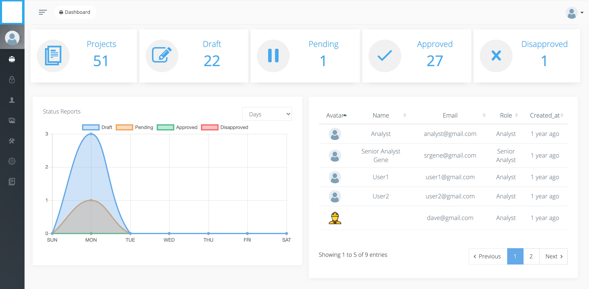

# Canvas Project Management Application
Built with Laravel & Vis.js

## Features
- Manage Users, Roles & Permissions
- Manage Projects (Add/Edit/Delete)
- Project Approval Lifecycle (Draft/Pending Approval/Approved/Reject)
- Project Versioning
- Reports
- Canvas Playground Built using Vis.js
    - Add/Edit/Delete Node & Node Properties
    - Add/Edit/Delete Edge & Edge Properties
    - Tabular Representations of Nodes and Edges
    - Ability to update your canvas objects properties using Tabular mode
    - Export Canvas to JPG, PNG, Excel, SVG, JSON, PDF
    - Ability to Re import JSON in Canvas
    - Auto Save Canvas
    - Project Updates History
    - Zoom In, Zoom Out & Full Screen Mode

## App Overview

